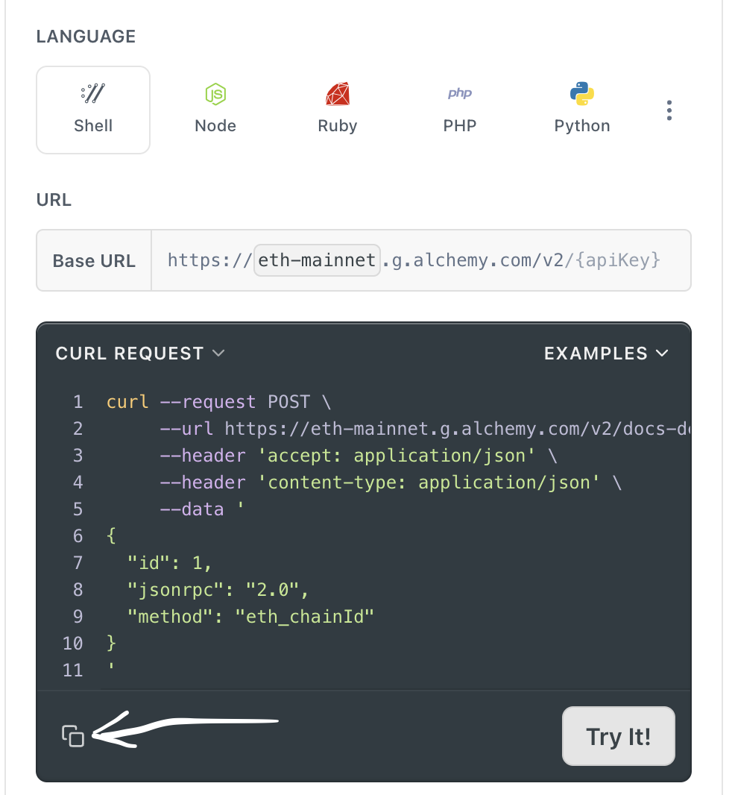
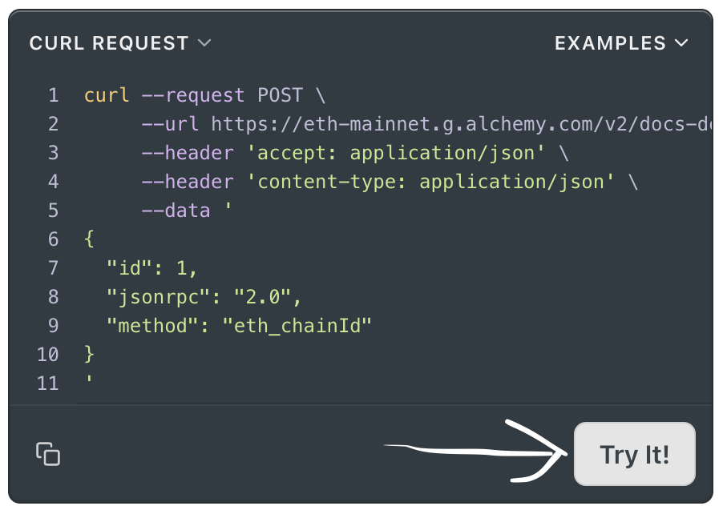
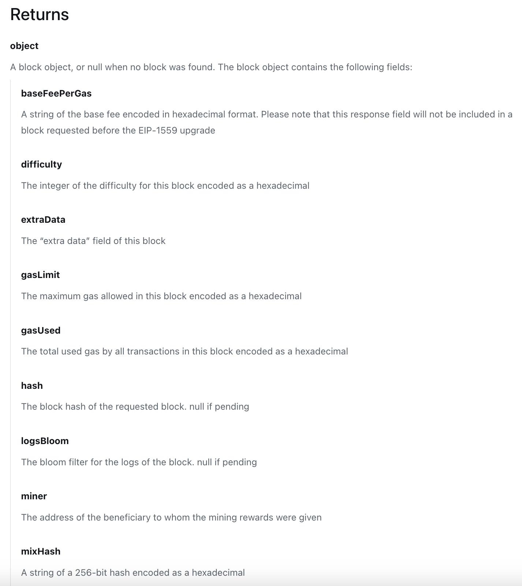

# How to create new page for RPC Methods Documentation.

## How to create a new page for RPC Methods Documentation

- 1. Go to [Alchemy References](https://docs.alchemy.com/reference/ethereum-api-endpoints) and click on the method you want to document to go to the page (further mentioned as **Alchemy Reference Page**).
- 2. Copy the method name and create a new file in `pages/ethereum-api` with the name `methodName.mdx`.
- 3. Create a new component in `components/method-docs/ethereum` with the name `EthereumMethod_methodName.tsx`.
- 4.  Let's use `EthereumMethod_getBlockByNumber.tsx` as reference file for the new file creation.
      Copy the content of `EthereumMethod_getBlockByNumber.tsx` into the new file and replace the method name with the new method name.
- 5. Import the new `EthereumMethod_methodName.tsx` component in the `methodName.mdx` file and render it.
- 6. Add `methodName` to the `_meta.json` in `pages/ethereum-api` folder.

## How to fill the content of code snippets in the new page

- 1. Go to **Alchemy Reference Page**, copy **cURL** request example as shown in the image below.
     
- 2. Go to [ChatGPT](https://chatgpt.com/) conversation and paste the cURL request example in the chat with the following prompt:

```
Hi! I need the analogs for the following HTTP request code in JS, Python, Go and Rust.
Use fetch for JS and Node.js
The following code is:
-- here goes cURL request code from Alchemy Reference Page--
```

- 3. After that, ChatGPT should provide you with the code snippets in JS, Python, Go and Rust.
     Use this snippets to fill the content of the code snippets in the new page.

     - 1. **Important**: For **cURL** make sure to escape line-breaking symbol "\\" (slash) with "\\\" (double-slash) in the code snippet.

     - 2. **Important**: Replace URL value in string with interpolated `${DRPC_ENDPOINT_URL}` in each string literal snippet. You can see how it's done in existing pages.

- 4. To get `Response` body from the **Alchemy Reference Page**
     click on **"Try"** button as shown on the image below and paste it in the `Response` section of the new page.



## How to fill Request Params and Response Params

- 1. Now, I personally find it more convenient to fill the Request Params and Response Params by looking at the **Quicknode Reference Page** for the same `methodName` that you currently copy/fill from **Alchemy Reference Page**.

For example, [eth_getBlockByNumber page](https://www.quicknode.com/docs/ethereum/eth_getBlockByNumber).

**Request Params** are shown like this:


**Response Params** are shown like this:



- 2. Copy and paste the **Request Params** and **Response Params** from the **Quicknode Reference Page** to the new page component props as required by format.

You can see example on the existing pages like [EthereumMethod_getBlockByNumber.tsx](./components/method-docs/ethereum//EthereumMethod_getBlockByNumber.tsx).

## How to fill the content of Use Cases and Constrains props.

- 1. Go to [ChatGPT](https://chatgpt.com/) and ask it to give 3 use cases and 3 constraints for the method you are documenting.
     Use the following prompt:

```
Hi! I need 3 use cases and 3 constraints, 3-6 words for each, for the following Ethereum method:
-- here goes the method name. For example getBlockByNumber --
```

#### **Note:** This guide is for Ethereum API methods documentation. You still can use this guide for other API methods documentation by changing the method name.
